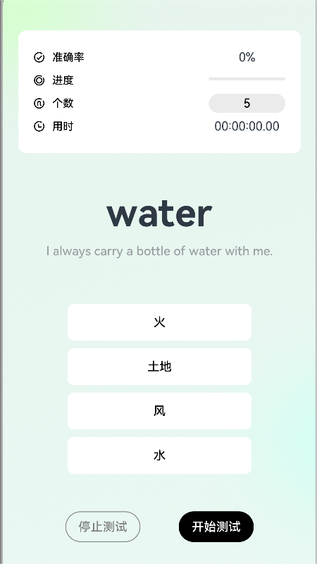
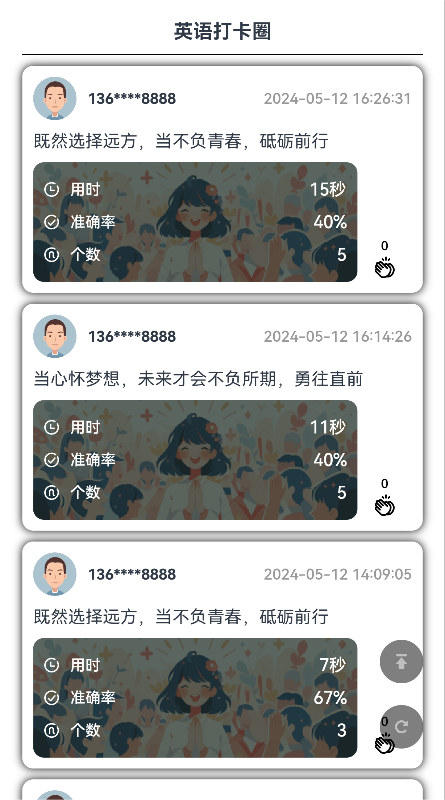
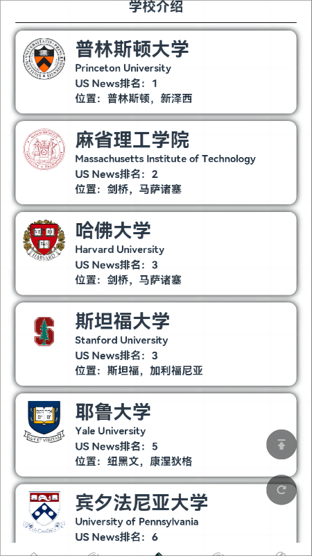
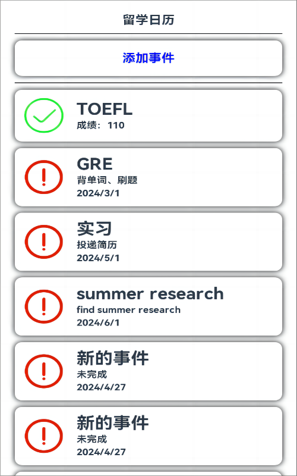
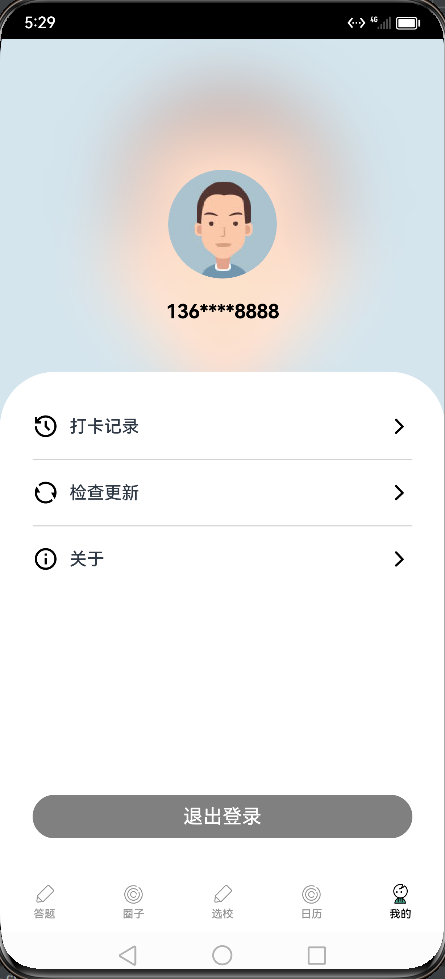
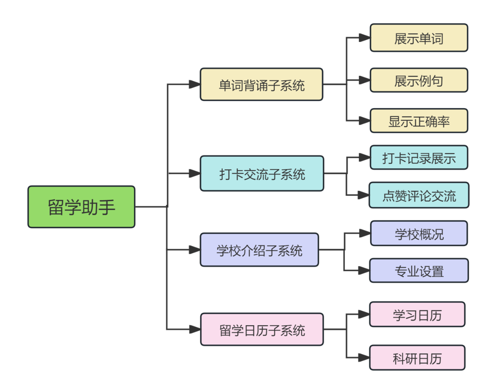
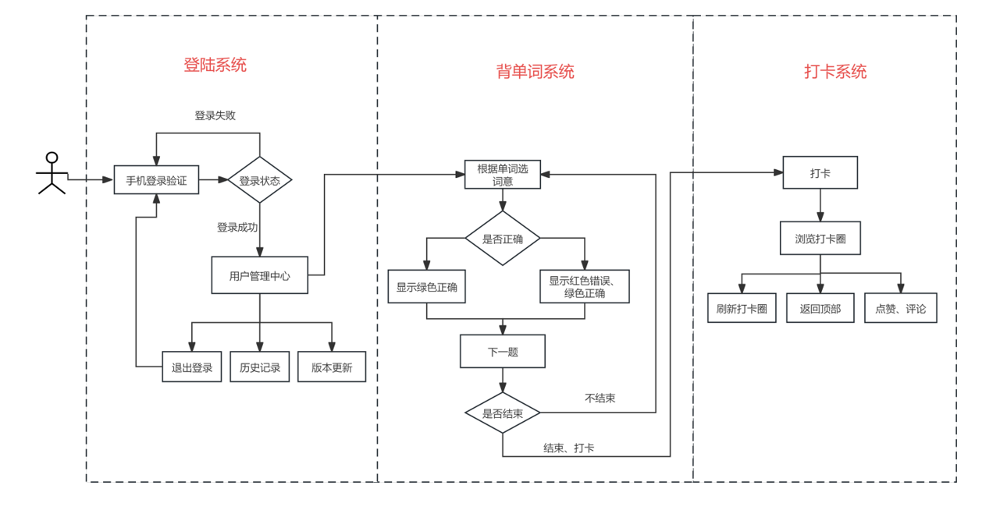
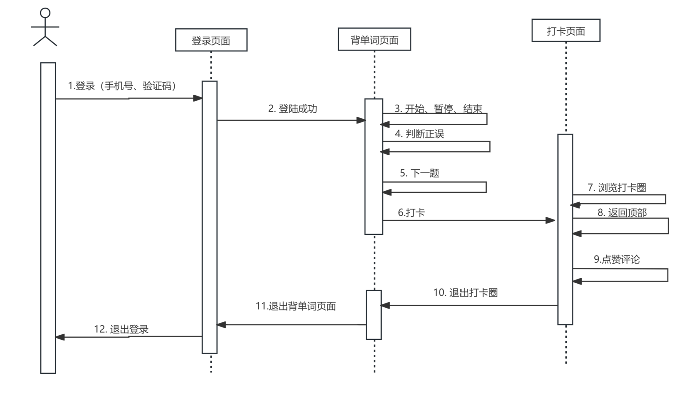
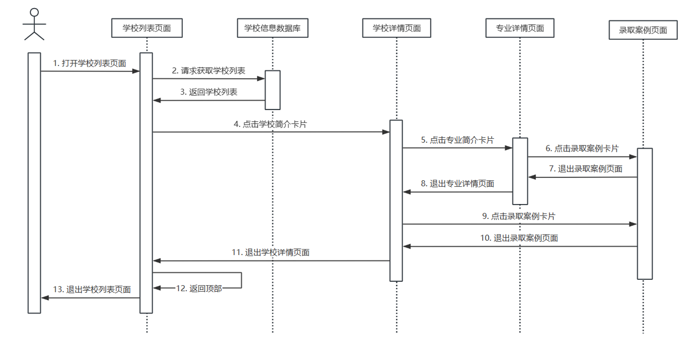
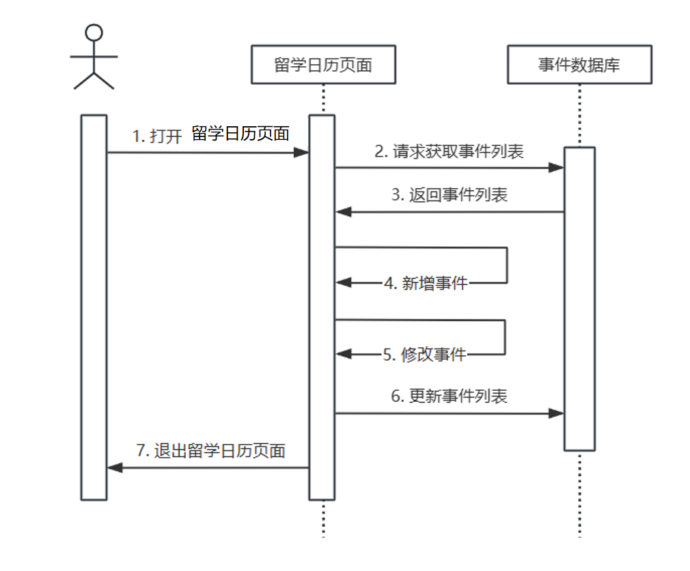

# 留学助手项目
[功能与需求分析PPT](report/功能与需求分析0429.pdf)

[结项汇报PPT](report/结项0513.pdf)

## 一、项目简介
在当今全球化的时代，留学已经成为许多人实现个人及职业发展目标的重要途径之一。由于涉及到语言考试、多项材料的准备、各种信息的获取和各种选择的权衡，许多人可能感到迷茫和无措。留学申请过程的复杂性常常令人望而却步。

为了能够帮助各位同学语言技能提升、梳理申请流程，解决他们的疑惑和困惑，同时打造一个留学信息分享、交流的平台。我们团队决定开发留学助手项目，采用敏捷开发方法，以迭代的方式逐步完善功能，以应对用户需求的快速变化。

<!-- 第一行图片 -->

    
    

<!-- 添加一个空行 -->

 <!-- 可调整间距 -->

<!-- 第二行图片 -->

    
    
    

## 二、功能简介

**单词背诵：** 为了帮助留学生们准备语言类考试，留学小助手提供单词打卡功能。该功能将展示单词、例句和一些选项，由用户从选项中选择正确的释义。程序会根据用户的使用情况记录一些数据，如回答正确率、学习时长等。在每日单词打卡完成后，用户可以发帖记录学习成果。

**打卡交流：** 为了提升用户的参与感和互动性，提供打卡社区的功能，用于展示所有用户的打卡记录。功能包括显示当前用户的昵称和头像、背诵单词时长、正确个数与答题个数、打卡帖子、帖子点赞数、评论数

**学校介绍：** 为了帮助留学生们择校，留学小助手提供全球各地的大学介绍，包括学校概况、专业设置、学校排名等信息。用户可以根据自己的兴趣和需求筛选学校并查看详细信息。

**留学日历：** 为了帮助留学生们规划学习、科研和申请活动，留学小助手提供留学日历功能。除留学所需的常见事项外，用户也可以创建个人化的留学日程。

## 三、系统架构
#### 总体系统图

#### 登录背单词打卡系统

#### 学校介绍子系统UML图

#### 留学日历子系统UML图

## 参考
[尚硅谷2024最新鸿蒙开发HarmonyOS4.0+鸿蒙NEXT星河版零基础教程](https://www.bilibili.com/video/BV1Ti4y1s79B/?p=72&spm_id_from=333.880.my_history.page.click)

[HarmonyOS 4.0 应用开发](https://www.yuque.com/danny-sroga/gaguqh/qg2n2d5o04iu1gsm?singleDoc#vCJBv  ) 
密码：gps8

[HarmonyOS 4.0实战项目之单词打卡](https://www.yuque.com/danny-sroga/gaguqh/eocenh0ig73g9ymq?singleDoc#O56iD) 
密码：za5u
