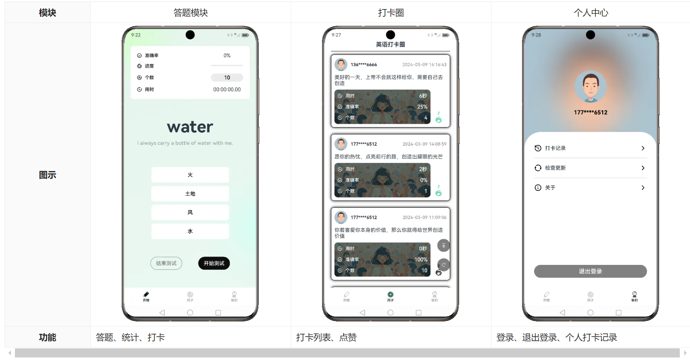

# 单词打卡项目

## 项目简介
该App的核心功能是辅助单词记忆，主要分为三个功能模块，如下图所示


#### 功能简介

* 答题页面共有三个练习状态，分别是答题状态、暂停状态和停止状态。初始状态为停止状态，停止状态下不可答题，此时点击答案选项，需要给出提示
* 在停止状态下，可以修改测试的单词个数（其余状态下均不可修改），如下图所示。个数修改后，需要从题库中重新抽取相应个数的题目。
* 点击开始测试按钮即可进入答题状态，此时，计时器开始计时
* 答题过程中点击暂停测试按钮可进入暂停状态，暂停状态下，计时器停止计时。
* 再次点击开始测试，重新进入答题状态，计时器恢复计时。
* 当本轮测试题目全部完成或者提前点击结束测试按钮，进入停止状态，并弹窗显示统计结果


*  点击右上角关闭按钮，弹窗关闭，同时测试题目和统计信息重置，答题页面回到初始状态。
*  点击再来一局按钮，弹窗关闭，同时测试题目和统计信息重置，然后直接进入答题状态。
*  点击登录打卡按钮，弹窗关闭，同时测试题目和统计信息重置，然后跳转到到登录页面。


####　常用命令
```
1. 常用布局的使用：Column、Row等等
2. 常用组件的使用：Progress、Button、Image、Text、TextTimmer（计时器）等等
3. 自定义组件
4. 自定义弹窗
5. 组件状态管理：@State、@Prop、@Link、@Watch等等
```

## 参考
[尚硅谷2024最新鸿蒙开发HarmonyOS4.0+鸿蒙NEXT星河版零基础教程](https://www.bilibili.com/video/BV1Ti4y1s79B/?p=72&spm_id_from=333.880.my_history.page.click)

[HarmonyOS 4.0 应用开发](https://www.yuque.com/danny-sroga/gaguqh/qg2n2d5o04iu1gsm?singleDoc#vCJBv  ) 
密码：gps8

[HarmonyOS 4.0实战项目之单词打卡](https://www.yuque.com/danny-sroga/gaguqh/eocenh0ig73g9ymq?singleDoc#O56iD) 
密码：za5u


## 开发过程


